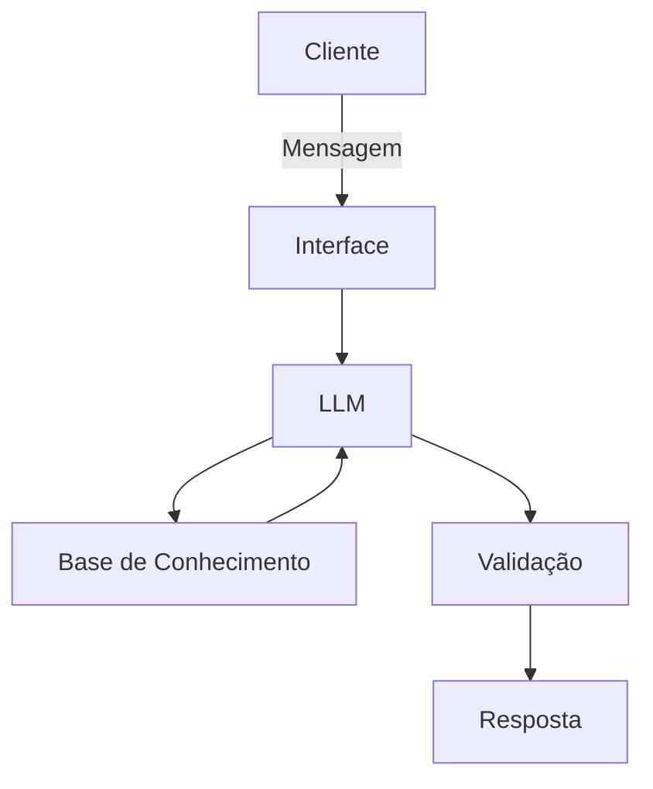

# Documentação do Agente

## Caso de Uso

### Problema
> Qual problema financeiro seu agente resolve?

Muitos usuários têm dificuldade para entender a fatura do cartão de crédito, especialmente quando envolvem conceitos como pagamento mínimo, crédito rotativo, parcelamentos e incidência de juros. Isso pode levar a decisões financeiras inadequadas, como pagar apenas o valor mínimo da fatura sem compreender o impacto dos juros acumulados.

Além disso, a linguagem utilizada nas faturas costuma ser técnica e pouco intuitiva, o que dificulta a compreensão por parte do usuário comum.

O agente proposto busca simplificar essa interpretação, permitindo que o usuário faça perguntas em linguagem natural e receba explicações claras sobre sua fatura, seus gastos e possíveis impactos financeiros.

---

### Solução
> Como o agente resolve esse problema de forma proativa?

O agente funciona como um **educador financeiro sobre a fatura do cartão de crédito**, capaz de interpretar perguntas do usuário sobre sua fatura de cartão de crédito e responder com explicações claras e contextualizadas.

A solução permite que o usuário:

- compreenda os valores presentes na fatura
- identifique categorias de gastos
- entenda o impacto do pagamento mínimo
- visualize simulações simples de juros do crédito rotativo
- esclareça dúvidas sobre termos financeiros

Utilizando **IA generativa combinada com dados estruturados da fatura**, o agente interpreta a pergunta do usuário e fornece respostas educativas e contextualizadas, ajudando o cliente a tomar decisões financeiras mais informadas.

---

### Público-Alvo
> Quem vai usar esse agente?

O agente é destinado a:

- usuários de cartão de crédito que desejam compreender melhor sua fatura
- clientes com pouca familiaridade com conceitos financeiros
- pessoas que desejam analisar seus gastos de forma mais clara
- clientes que buscam suporte rápido sem precisar acessar atendimento humano

O foco principal está em **usuários comuns que desejam interpretar melhor sua fatura de cartão de crédito**, independentemente do nível de conhecimento financeiro.

---

# Persona e Tom de Voz

### Nome do Agente

**Clara — Assistente de Faturas**

(O nome "Clara" remete à ideia de **clareza financeira**.)

---

### Personalidade
> Como o agente se comporta? (ex: consultivo, direto, educativo)

O agente possui uma personalidade:

- **educativa**
- **consultiva**
- **clara e paciente**

Seu objetivo principal é ajudar o usuário a **entender sua situação financeira sem julgamentos**, explicando conceitos financeiros de forma didática.

Ele evita jargões técnicos e sempre busca simplificar explicações complexas.

---

### Tom de Comunicação
> Formal, informal, técnico, acessível?

O tom de comunicação é:

- **acessível**
- **educativo**
- **profissional, mas amigável**

O agente utiliza uma linguagem simples, evitando termos técnicos sempre que possível e explicando conceitos financeiros quando necessário.

O objetivo é que qualquer pessoa consiga compreender a resposta.

---

### Exemplos de Linguagem

**Saudação**

> "Olá! Eu posso te ajudar a entender melhor sua fatura do cartão. O que você gostaria de verificar?"

**Confirmação**

> "Entendi! Vou analisar essa informação da sua fatura."

ou

> "Certo! Deixa eu te explicar como esse valor foi calculado."

**Erro / Limitação**

> "No momento não encontrei essa informação na sua fatura.  
> Mas posso ajudar a explicar como funcionam os valores do cartão ou verificar outros itens."

---

# Arquitetura

### Diagrama

---

## Componentes

| Componente | Descrição |
|------------|-----------|
| Interface | Chatbot interativo desenvolvido em **Streamlit** |
| LLM | Ollama (local) |
| Base de Conhecimento | **JSON ou CSV** mockados |
| Validação | Camada de verificação que garante que as respostas utilizem apenas dados presentes na base da fatura e evita respostas inventadas pela IA |

---

## Segurança e Anti-Alucinação

### Estratégias Adotadas

- [x] Agente responde apenas com base nos dados da fatura fornecida  
- [x] Respostas incluem referência aos dados utilizados (valores da fatura ou transações)  
- [x] Quando não possui informação suficiente, o agente informa explicitamente ao usuário  
- [x] O agente não realiza recomendações financeiras  

---

### Limitações Declaradas
> O que o agente NÃO faz?

O agente possui as seguintes limitações explícitas:

- não acessa contas bancárias reais ou dados financeiros externos  
- não executa pagamentos ou transações financeiras  
- não substitui aconselhamento financeiro profissional  
- não fornece recomendações de investimento personalizadas  
- depende exclusivamente das informações de fatura fornecidas para gerar respostas  
- não possui acesso a dados em tempo real do banco ou operadora do cartão  

Seu objetivo é **explicar e interpretar informações da fatura do cartão**, ajudando o usuário a compreender melhor seus gastos e possíveis impactos financeiros.